# GymTracker


Aplikacja mobilna **GymTracker** — prosta aplikacja do śledzenia treningów siłowych i postępów.

## Opis
GymTracker pomaga rejestrować ćwiczenia, serie, powtórzenia i ciężary, dzięki czemu możesz śledzić swoje postępy i planować treningi.

## Najważniejsze funkcje
- Tworzenie i edycja planów treningowych
- Rejestrowanie serii, powtórzeń i ciężarów
- Historia treningów i podsumowania postępów
- Proste, czytelne UI (Android)
- Statystyki i wykresy postępów (MPAndroidChart)

## Screenshots
Poniżej znajdują się przykładowe widoki aplikacji.

### 1) Start / Logowanie
Ekran startowy z przyciskami logowania i rejestracji.  
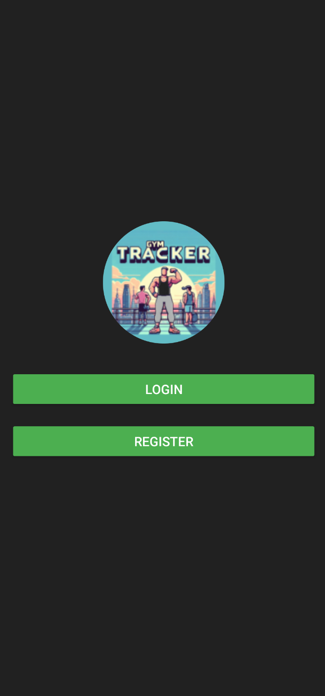

### 2) Rejestracja (konto)
Formularz rejestracji użytkownika.  
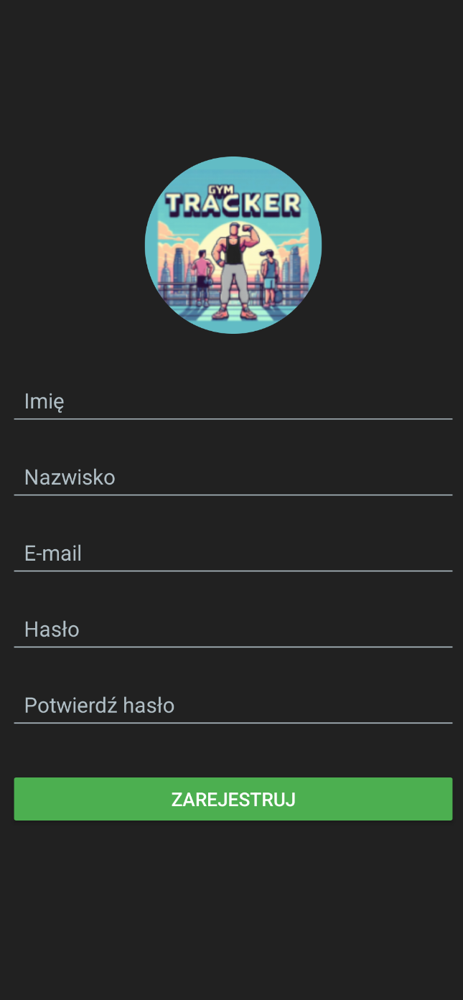

### 3) Rejestracja (profil)
Uzupełnianie danych profilu (płeć, wzrost, obwody, masa ciała).  
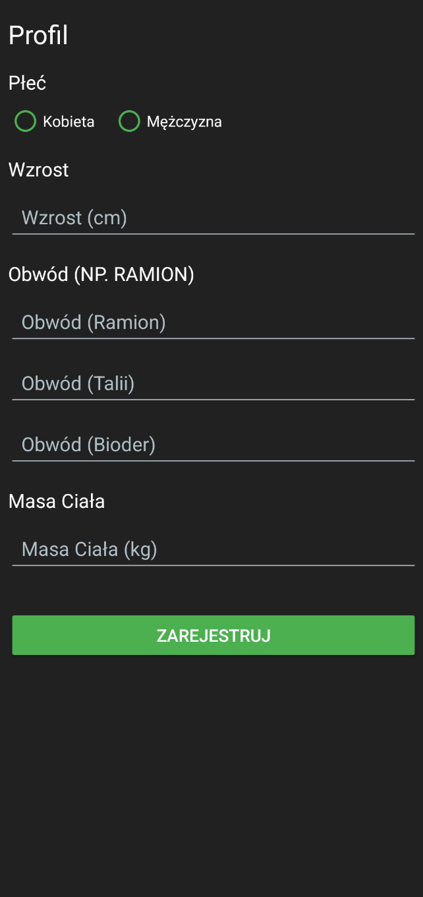

### 4) Wybór dni treningowych
Wybór dni w tygodniu, w które użytkownik planuje trening.  
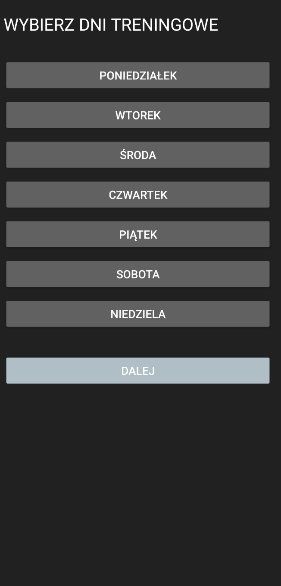

### 5) Trening – dodawanie serii i ćwiczeń
Widok treningu (np. Poniedziałek): dodawanie serii i przejście dalej.  
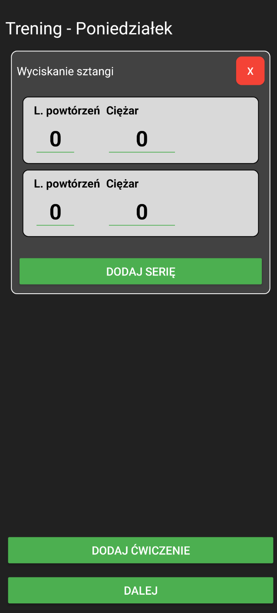

### 6) Wybór ćwiczenia
Lista ćwiczeń do dodania do treningu.  
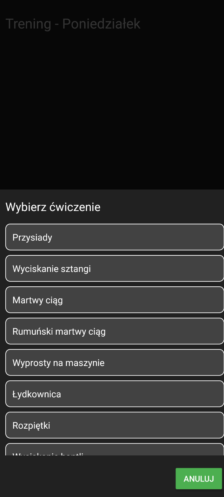

### 7) Podgląd treningu / kalendarz
Wybór dnia + podsumowanie treningu, edycja i zapis.  
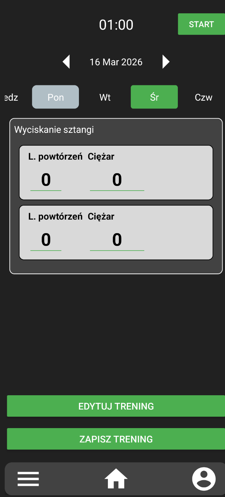

### 8) Menu główne
Dostęp do modułów: cele treningowe, aktualizacja planu, aktualizacja obwodów.  
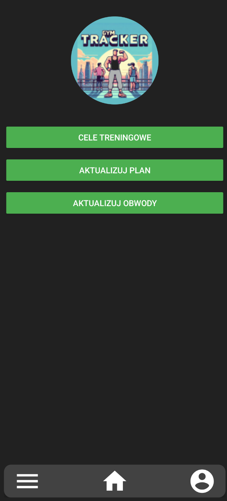

### 9) Cele treningowe
Ustawienie celu wagi oraz docelowej liczby dni treningowych w tygodniu.  
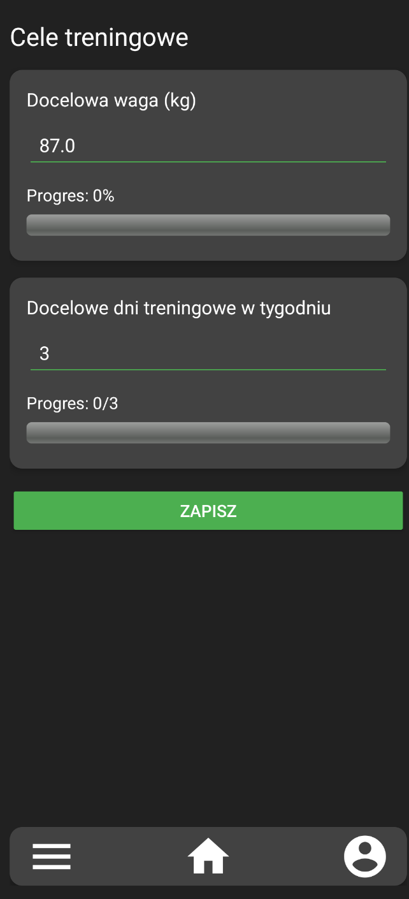

### 10) Profil użytkownika
Szybki podgląd wyników + wejście w progres/osiągnięcia/ustawienia konta.  
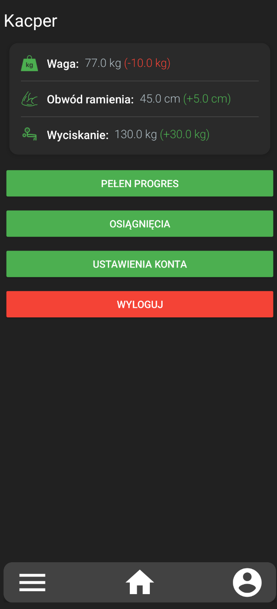

### 11) Pełen progres
Szczegółowe statystyki i wykresy zmian (waga, obwody, rekordy).  
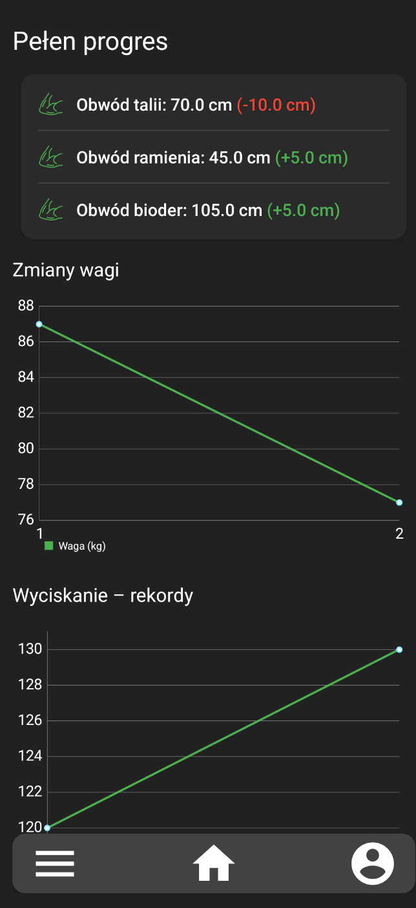

## Wymagania
- Android Studio (zalecane najnowsze wydanie)
- Android SDK (minSdk 24)
- JDK 11 (zgodnie z konfiguracją Gradle w projekcie)
- Gradle (projekt zawiera wrapper — `./gradlew`)

## Instalacja (lokalnie)
1. Sklonuj repozytorium:
   ```bash
   git clone https://github.com/kacperszczudlo/GymTracker.git
   ```
2. Otwórz projekt w Android Studio:
   - **File → Open** → wybierz folder projektu
3. Pozwól Android Studio pobrać zależności i zbudować projekt.
4. Uruchom na emulatorze lub urządzeniu fizycznym.

## Budowanie z linii poleceń
- Przy pierwszym uruchomieniu:
  ```bash
  ./gradlew clean
  ```
- Zbudowanie debug APK:
  ```bash
  ./gradlew assembleDebug
  ```
- Testy jednostkowe:
  ```bash
  ./gradlew test
  ```

## Uruchamianie
- W Android Studio: **Run** → wybierz konfigurację i kliknij **Run**.
- Z linii poleceń możesz użyć `adb` do instalacji:
  ```bash
  adb install -r app/build/outputs/apk/debug/app-debug.apk
  ```

## Architektura projektu
Projekt napisany jest w Javie i jest zorganizowany w typowe warstwy:
- UI (Activities / Fragments)
- Warstwa danych (np. modele, repozytoria)
- Logika aplikacji (serwisy / kontrolery)

## Kontrybuowanie
1. Forkuj repozytorium.
2. Stwórz branch: `git checkout -b feature/nazwa-funkcji`
3. Dodaj testy, jeśli to możliwe.
4. Zrób PR opisując zmiany i powód.

## Zgłaszanie błędów i propozycje
- Użyj GitHub Issues: https://github.com/kacperszczudlo/GymTracker/issues

## Licencja
Dodaj plik `LICENSE` (np. MIT), jeśli chcesz udostępniać projekt na konkretnej licencji.
